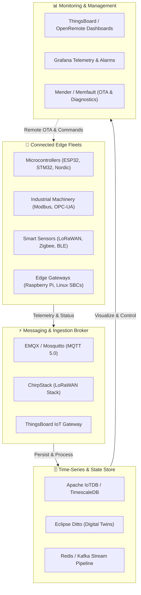

<div align="center">

<a href="https://github.com/ishandutta2007/Awesome-Remote-Device-Monitoring">
  
</a>

# 📡 Awesome Remote Device Monitoring

<p align="center">
  <strong>A curated list of elite SaaS platforms, open-source stacks, IoT fleet management systems, edge telemetry engines, and embedded diagnostics frameworks.</strong>
</p>

<p align="center">
  <a href="https://github.com/ishandutta2007/Awesome-Awesome-Awesome"></a><a href="https://discord.gg/jc4xtF58Ve"></a>
  <a href="https://github.com/ishandutta2007/Awesome-Remote-Device-Monitoring/stargazers"></a>
  <a href="https://github.com/ishandutta2007/Awesome-Remote-Device-Monitoring/network/members"></a>
  <a href="https://github.com/ishandutta2007/Awesome-Remote-Device-Monitoring/issues"></a>
  <a href="LICENSE"></a>
  <a href="https://github.com/ishandutta2007/Awesome-Remote-Device-Monitoring/pulls"></a>
  <a href="https://github.com/ishandutta2007"></a>
</p>

</div>

---

## 🧭 Executive Summary & SEO Overview

**Remote Device Monitoring (RDM)** encompasses the end-to-end hardware-to-cloud architecture designed to collect telemetry, monitor device health and status, deploy Over-The-Air (OTA) firmware updates, automate alerting, and orchestrate massive fleets of distributed microcontrollers, Linux single-board computers, sensors, smart meters, and industrial machinery.

Key pillars covered in this repository:
- **Telemetry Collection & Ingestion**: Real-time streaming via lightweight protocols including MQTT, CoAP, HTTP/REST, LwM2M, and LoRaWAN.
- **Fleet Diagnostics & Crash Observability**: Core dump triage, embedded logging, kernel tracing, and battery telemetry.
- **Edge Computing & Protocol Gateways**: Southbound data translation from industrial Modbus, OPC-UA, CANbus, and BACnet into cloud streams.
- **Digital Twins & Visualization**: Dynamic state shadowing, real-time dashboards, SCADA-style HMI panels, and automated rule engines.

---

## 📑 Table of Contents

- [🌐 Market Size & Industry Structure](#-market-size--industry-structure)
- [☁️ SaaS & Hosted Device Monitoring Platforms](#️-saas--hosted-device-monitoring-platforms)
- [💻 Open-Source Device Monitoring Projects](#-open-source-device-monitoring-projects)
- [🛠️ Architectural Foundations & Stack Guide](#️-architectural-foundations--stack-guide)
- [📈 Star History](#-star-history)
- [🤝 How to Contribute](#-how-to-contribute)
- [⚖️ Disclaimer & Security Notice](#️-disclaimer--security-notice)

---

## 🌐 Market Size & Industry Structure

> **Market Valuation & Dynamics**: The global Remote Device Monitoring and IoT Fleet Management sector is estimated at **$4.8 Billion in 2024–2026** and is projected to surpass **$16.5 Billion by 2032** (growing at a compound annual growth rate of **~19.2%**). The sector is **moderately to highly fragmented** rather than a winner-take-all monopoly, because divergent industry verticals—such as industrial manufacturing (OPC-UA/Modbus), smart agriculture (LoRaWAN/cellular), automotive telematics (CANbus), healthcare equipment (HIPAA-compliant telemetry), and consumer electronics—demand purpose-built protocols, specialized edge hardware, compliance certifications, and distinct hybrid-cloud deployment models.

---

## ☁️ SaaS & Hosted Device Monitoring Platforms

The following commercial and hosted platforms deliver turnkey infrastructure for IoT fleet tracking, telemetry dashboards, remote control, and embedded diagnostics. 

*Table is sorted descending by Company Valuation / Revenue scale.*

| 🚀 Platform | 🏢 Company Scale (Valuation / Revenue) | 🏷️ Starting Tier Pricing | 🎁 Free Tier / Trial Limits | 🔍 Core Capabilities & Highlights |
| :--- | :--- | :--- | :--- | :--- |
| **[AWS IoT Device Management](https://aws.amazon.com/iot-device-management/)** | **$2.2T+ Market Cap** (~$105B+ AWS ARR) | **$0.10 / device / month** (plus $0.008 per remote job execution) | **Free for 12 months** up to 50 managed devices/month & 250 remote action executions/month | Enterprise-grade bulk device registration, real-time fleet indexing, granular attribute search, secure remote tunneling (SSH/VNC), and staged OTA updates. |
| **[Datadog IoT Monitoring](https://www.datadoghq.com/product/iot-monitoring/)** | **~$38B Market Cap** (~$2.6B ARR) | **$5.00 / device / month** (billed annually) | **14-day free trial** with full access for up to 5 edge devices / IoT hosts | End-to-end device observability: embedded Linux metrics, OS telemetry, network socket tracing, device crash detection, and correlated log analysis. |
| **[Particle Device Cloud](https://www.particle.io/)** | **~$200M Valuation** (~$25M ARR) | **$299.00 / month** (Growth Plan, supports up to 500 devices) | **Free forever plan** for up to 100 devices (Wi-Fi or cellular) with 100,000 Data Operations/month | Integrated cellular and Wi-Fi fleet management, over-the-air firmware flashes, cloud compiler, developer console, and real-time device health vitals. |
| **[Memfault](https://memfault.com/)** | **~$150M Valuation** (~$15M ARR) | **$250.00 / month** (Team Plan, covers up to 100 connected devices) | **Free forever plan** for up to 100 devices (MCU, Android, embedded Linux) with automated issue triage | Embedded diagnostics platform: automated coredump deduplication, hard-fault backtraces, memory leak tracking, cohort-based OTA rollouts, and device vitals. |
| **[MachineMetrics](https://www.machinemetrics.com/)** | **~$100M Valuation** (~$10M ARR) | **$100.00 / machine / month** ($1,200/machine/year billed annually, minimum 5 machines) | **14-day free trial** for 1 industrial machine with edge hardware adapter & live streaming | Industrial IoT edge connectivity, automated machine state collection, high-frequency PLC telemetry, predictive maintenance, and real-time shop-floor analytics. |
| **[EMQX Cloud](https://www.emqx.com/en/cloud)** | **~$80M Valuation** (~$12M ARR) | **$19.00 / month** (Serverless starter base; $0.15/GB data transfer) | **Free forever tier** (Serverless) includes 1,000,000 connection-minutes & 1 GB traffic every month | Fully managed cloud-native MQTT message broker, massive device concurrency, SQL-based real-time rule engine, and instant integrations with Kafka, AWS, and GCP. |
| **[ClearBlade IoT Core & Enterprise](https://www.clearblade.com/)** | **~$60M Valuation** (~$8M ARR) | **$500.00 / month** (Starter IoT Core tier) | **30-day free trial** with up to 25 connected devices and 100,000 messages | Scalable IoT Core messaging infrastructure, edge compute orchestration, offline local edge execution, and migration compatibility for legacy Google Cloud IoT Core. |
| **[ThingsBoard Cloud](https://thingsboard.io/)** | **~$30M Valuation** (~$6M ARR) | **$10.00 / month** (Maker Plan: 30 devices, 30 assets, 3,000,000 data points/month) | **30-day free trial** of Cloud Professional Edition with 30 devices & 3,000,000 data points | Hosted multi-tenant IoT platform, 30+ interactive customizable widget dashboards, visual drag-and-drop rule engine, asset hierarchy trees, and alarms. |
| **[Blynk IoT](https://blynk.io/)** | **~$25M Valuation** (~$5M ARR) | **$6.99 / month** (Plus Plan: up to 20 devices, billed annually at $83.88/year) | **Free forever plan** for up to 2 active devices, 1 user, web console, and mobile app access | Low-code suite featuring instant native iOS/Android companion apps, drag-and-drop web consoles, Wi-Fi device provisioning, and automated firmware OTA. |
| **[Ubidots](https://ubidots.com/)** | **~$20M Valuation** (~$4M ARR) | **$49.00 / month** (Essential Plan: 10 devices, 500k dots/month, 10 SMS/voice alerts) | **30-day free trial** with 5 devices; STEM tier is free forever for personal use (3 devices, 4,000 dots/day) | Application enablement platform for industrial telemetry, synthetic mathematical variables, multi-channel alerting (SMS, Webhooks, WhatsApp), and branded portals. |
| **[Losant Enterprise IoT](https://www.losant.com/)** | **~$15M Valuation** (~$3.5M ARR) | **$1,500.00 / month** (Developer / Starter Environment: 100 devices, 5M payloads/month) | **Free Developer Sandbox forever** for up to 10 devices, 1 application, and 100,000 payloads/month | Low-code enterprise workflow engine, containerized edge compute runtime, digital twin modeling, and custom white-label portals for enterprise clients. |
| **[Datacake](https://datacake.co/)** | **~$12M Valuation** (~$3M ARR) | **€1.00 / device / month** (~$1.10/dev/mo billed annually; minimum billing €10.00/month) | **Free forever plan** for up to 2 devices with full dashboard access, alerts, and 500 data points/day | Low-code IoT platform tailored for LoRaWAN, cellular, and satellite devices with pre-configured sensor payload templates and white-label client dashboards. |

---

## 💻 Open-Source Device Monitoring Projects

The open-source ecosystem offers immense flexibility, air-gapped data sovereignty, zero per-device license costs, and deep customization.

*Sorted strictly descending by GitHub Star Count.*

1. 🏠 **[Home Assistant Core](https://github.com/home-assistant/core)** [](https://github.com/home-assistant/core/stargazers)  
   The world's most popular open-source local home and device monitoring platform. Tracks thousands of IoT sensors, smart plugs, energy monitors, and gateways locally without cloud dependencies.

2. 🔀 **[Node-RED](https://github.com/node-red/node-red)** [](https://github.com/node-red/node-red/stargazers)  
   Flow-based visual low-code development tool for wiring together physical devices, industrial protocols, APIs, and online dashboard services via a browser-based flow editor.

3. 📊 **[ThingsBoard](https://github.com/thingsboard/thingsboard)** [](https://github.com/thingsboard/thingsboard/stargazers)  
   Premier enterprise open-source IoT platform for device management, telemetry data collection, processing, and interactive real-time visualization. Supports MQTT, HTTP, CoAP, and LwM2M protocols.

4. ⚡ **[EMQX](https://github.com/emqx/emqx)** [](https://github.com/emqx/emqx/stargazers)  
   Ultra-scalable open-source distributed MQTT broker written in Erlang. Scales to 100M+ concurrent IoT device connections with sub-millisecond latency, SQL rule engine, and data streaming.

5. 💡 **[ESPHome](https://github.com/esphome/esphome)** [](https://github.com/esphome/esphome/stargazers)  
   Declarative YAML-based firmware and remote monitoring system for ESP8266 and ESP32 microcontrollers. Enables continuous sensor telemetry reporting and remote OTA firmware updates.

6. 📨 **[Eclipse Mosquitto](https://github.com/eclipse/mosquitto)** [](https://github.com/eclipse/mosquitto/stargazers)  
   Lightweight, highly performant C-based open-source MQTT message broker implementing MQTT v5.0, v3.1.1, and v3.1. Perfect for constrained edge devices, Raspberry Pi nodes, and IoT gateways.

7. 🪵 **[Fluent Bit](https://github.com/fluent/fluent-bit)** [](https://github.com/fluent/fluent-bit/stargazers)  
   Fast and lightweight telemetry agent, log processor, and forwarder. Highly optimized for embedded Linux devices, edge nodes, and IoT gateways with minimal CPU and memory footprint.

8. 🗄️ **[Apache IoTDB](https://github.com/apache/iotdb)** [](https://github.com/apache/iotdb/stargazers)  
   High-performance native time-series database optimized for IoT remote device monitoring, massive industrial telemetry ingestion, edge-cloud sync, and compact storage.

9. 📱 **[Blynk Library](https://github.com/blynkkk/blynk-library)** [](https://github.com/blynkkk/blynk-library/stargazers)  
   Official firmware library enabling over 400 microcontrollers (ESP32, ESP8266, Arduino, Particle, Raspberry Pi) to connect securely and report telemetry directly to dashboards and mobile devices.

10. 🏎️ **[Eclipse Zenoh](https://github.com/eclipse-zenoh/zenoh)** [](https://github.com/eclipse-zenoh/zenoh/stargazers)  
    Zero-overhead pub/sub, distributed storage, and query protocol designed for edge robotics, autonomous vehicles, and ultra-constrained embedded networks.

11. 🛡️ **[Magistrala (Mainflux)](https://github.com/absmach/magistrala)** [](https://github.com/absmach/magistrala/stargazers)  
    Modern, secure, open-source microservices IoT cloud platform written in Go. Features multi-protocol adapters (HTTP, MQTT, CoAP, WebSocket), device identity management, and fine-grained access control.

12. 🚀 **[NanoMQ](https://github.com/emqx/nanomq)** [](https://github.com/emqx/nanomq/stargazers)  
    Ultra-lightweight edge MQTT broker and messaging bus built in pure C with POSIX threads and NNG. Designed specifically for resource-constrained embedded gateways and edge industrial controllers.

13. 🌉 **[ThingsBoard IoT Gateway](https://github.com/thingsboard/thingsboard-gateway)** [](https://github.com/thingsboard/thingsboard-gateway/stargazers)  
    Open-source Python modular gateway that integrates legacy and industrial protocols (Modbus RTU/TCP, OPC-UA, BACnet, BLE, CANbus, SNMP, and REST) with cloud IoT platforms.

14. 🏙️ **[OpenRemote](https://github.com/openremote/openremote)** [](https://github.com/openremote/openremote/stargazers)  
    Full-stack 100% open-source IoT platform designed for smart city deployments, energy grid management, building asset monitoring, and geographic device fleet mapping.

15. 🏭 **[EdgeX Foundry (EdgeX Go)](https://github.com/edgexfoundry/edgex-go)** [](https://github.com/edgexfoundry/edgex-go/stargazers)  
    Linux Foundation vendor-neutral edge computing framework for industrial IoT. Provides dual-tier microservices for southbound sensor ingestion and northbound cloud streaming.

16. 🦒 **[Kaa IoT](https://github.com/kaaproject/kaa)** [](https://github.com/kaaproject/kaa/stargazers)  
    Cloud-native open-source microservices IoT platform for device telemetry analytics, sensor payload visualization, multi-tenant hierarchy, and automated device credential management.

17. 📦 **[open-balena](https://github.com/balena-io/open-balena)** [](https://github.com/balena-io/open-balena/stargazers)  
    Open-source platform to deploy, update, monitor, and manage fleets of connected Linux edge devices via containerized micro-applications and VPN tunneling.

18. 🔄 **[Mender](https://github.com/mendersoftware/mender)** [](https://github.com/mendersoftware/mender/stargazers)  
    Open-source over-the-air (OTA) software and firmware update manager for connected Linux devices. Guarantees atomic dual-partition failover recovery and delta updates.

19. 🐝 **[HiveMQ Community Edition](https://github.com/hivemq/hivemq-community-edition)** [](https://github.com/hivemq/hivemq-community-edition/stargazers)  
    Java-based open-source MQTT broker implementing MQTT 3.1.1 and 5.0 specifications, built for high-throughput enterprise messaging and event-driven device architectures.

20. 📡 **[ChirpStack](https://github.com/chirpstack/chirpstack)** [](https://github.com/chirpstack/chirpstack/stargazers)  
    Open-source LoRaWAN Network Server stack modularly managing regional wireless sensor gateways, cryptographic session keys, deduplication, and payload forwarding.

21. 👥 **[Eclipse Ditto](https://github.com/eclipse-ditto/ditto)** [](https://github.com/eclipse-ditto/ditto/stargazers)  
    Industrial open-source digital twin framework providing state synchronization, digital shadow abstraction, access control, and unified JSON APIs for real-world devices.

22. 🎯 **[Eclipse hawkBit](https://github.com/eclipse/hawkbit)** [](https://github.com/eclipse/hawkbit/stargazers)  
    Back-end framework providing rollout management, campaign monitoring, and targeted deployment of software and firmware updates to resource-constrained IoT targets.

23. 🎛️ **[Eclipse Kura](https://github.com/eclipse-kura/kura)** [](https://github.com/eclipse-kura/kura/stargazers)  
    OSGi-based application framework providing an edge computing container for M2M/IoT gateways, remote configuration, and field protocol translation.

---

## 🛠️ Architectural Foundations & Stack Guide

When architecting a production-grade Remote Device Monitoring solution, combine proven open-source building blocks or hybrid SaaS pipelines:



- **Core Full-Stack Platform**: [ThingsBoard](https://github.com/thingsboard/thingsboard) or [OpenRemote](https://github.com/openremote/openremote) for asset trees, alerting, multi-tenancy, and visual rule engines.
- **Messaging Backbone**: [EMQX](https://github.com/emqx/emqx) for large-scale fleets (10,000+ devices); [Mosquitto](https://github.com/eclipse/mosquitto) or [NanoMQ](https://github.com/emqx/nanomq) for lightweight edge-gateway brokers.
- **Field Gateway Integration**: [ThingsBoard IoT Gateway](https://github.com/thingsboard/thingsboard-gateway) or [EdgeX Foundry](https://github.com/edgexfoundry/edgex-go) to bridge Modbus, OPC-UA, CANbus, and BACnet hardware.
- **Firmware Updates & Observability**: [Mender](https://github.com/mendersoftware/mender) for failover OTA on Linux SBCs; [Memfault](https://memfault.com/) for automated crash dumping and MCU vitals.

---

## 📈 Star History

[](https://star-history.dera.page/#ishandutta2007/Awesome-Remote-Device-Monitoring&type=date&legend=top-left)

---

## 🤝 How to Contribute

We welcome contributions from IoT engineers, embedded developers, devops teams, and industrial automation practitioners!

1. 🍴 **Fork the repository** to your own GitHub account.
2. 🌿 **Create a new branch**:
   ```bash
   git checkout -b add-monitoring-tool
   ```
3. 📝 **Add your entry** in alphabetical or star-ranked order:
   - For SaaS: Include product name, official website, pricing starting tier, and exact free tier/trial limit.
   - For Open-Source: Include repository link, star badge (`style=social&color=white`), and a concise factual description.
4. 🚀 **Commit and submit a Pull Request** with a brief summary of the project's relevance.

---

## ⚖️ Disclaimer & Security Notice

- This curated list is maintained by the open-source community for educational, architectural, and operational reference only. Mention of third-party products does not constitute an official endorsement.
- Remote device monitoring systems handle sensitive hardware telemetry and remote command execution channels. Always enforce end-to-end TLS 1.3 encryption, mutual certificate authentication (mTLS), secure boot, compartmentalized token access, and rate limiting across your fleet.

---

<div align="center">
  <sub>Maintained with ❤️ by <a href="https://github.com/ishandutta2007">Ishan Dutta</a> and the global IoT engineering community.</sub>
</div>
